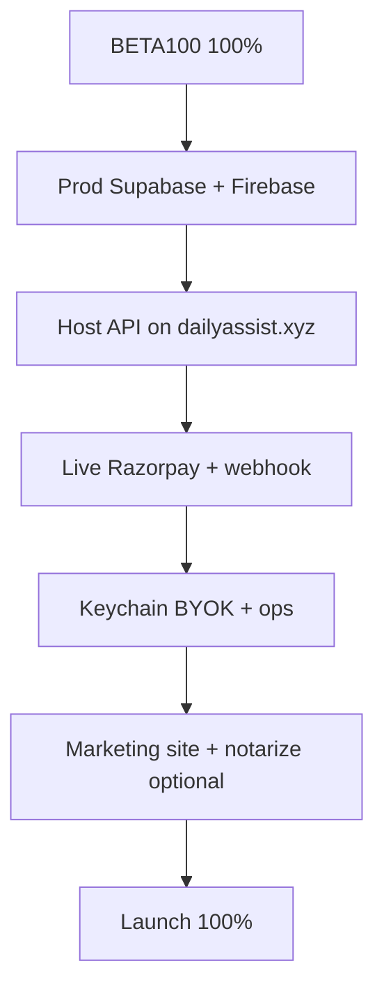

# Launch 100 Plan — AHA

**Product:** Launch (public paid product @ dailyassist.xyz)  
**Philosophy:** `AHA_PHILOSOPHY.md` — assistant language only  
**Status baseline:** ~65–70% complete → target **100%**  
**Prerequisite:** **`BETA100_PLAN.md` must be 100%** before Launch can be 100%

**Fast path:** **`TIER1_LAUNCH_PLAN.md`** — ship Tier-1 only (no BYOK) first; complete full Launch 100 after Tier-2 is ready.

---

## What “Launch 100” means

Strangers can land on **dailyassist.xyz**, **pay** (live Razorpay), **download** Mac/Windows builds, **install**, **sign in** (Firebase), get a **real license** from cloud, and use Tier‑1 + Tier‑2 with production-grade secrets and support — without founder intervention per user.

**Includes everything in Beta 100**, plus cloud, live money, public site, and ops.

---

## Prerequisite

```text
BETA100_PLAN.md  →  100%  →  then complete this plan
```

---

## Readiness checklist

### 1. Production cloud (blocking)

- [ ] Run **Supabase migrations** in production dashboard (`aha_users`, `aha_licenses`, `aha_vault_meta`, `aha_slots`, `supabase/migrations/003_payments.sql`, RLS)
- [ ] **Firebase production** project — companion config uses prod keys (not dev)
- [ ] **RLS smoke test** — user A cannot read user B license or vault metadata
- [ ] **License source of truth** — paid users validated against Supabase/Razorpay; disable `AHA_ALLOW_DEV_LICENSE` in production `.env` (`SUBSCRIPTION_SETUP.md`)
- [ ] **Service account / secrets** — Firebase admin JSON and Supabase service role only on server; never in client or git

### 2. Production hosting (blocking)

- [ ] Deploy **FastAPI** (or reverse proxy) on `https://www.dailyassist.xyz`
- [ ] Live routes: `/subscribe`, `/download`, `/api/billing/*`, `/api/auth/firebase_signin`, `/api/license/sync`, companion static/legal as needed
- [ ] **`downloads/AHA-mac.zip`** and **`downloads/AHA-win.zip`** served on live `/download`
- [ ] TLS, env vars, and deploy runbook documented (extend `DISTRIBUTION.md` or ops doc)

### 3. Production billing (blocking)

- [ ] **Live** `RAZORPAY_KEY_ID` and `RAZORPAY_KEY_SECRET` (not `rzp_test_*`)
- [ ] **Webhook** endpoint: `https://<live-domain>/api/billing/webhook`
- [ ] Subscribe to Razorpay event **`payment.captured`**
- [ ] **`RAZORPAY_WEBHOOK_SECRET`** in production `.env`
- [ ] **Smoke test** — one live minimum payment → `aha_payments.status = paid` in Supabase even if user closes browser before client verify (`BILLING.md`)

### 4. Security at launch standard

- [ ] **BYOK in macOS Keychain** — replace long-term plaintext `~/.aha/config.json` for API keys (REINVENT BYOK target)
- [ ] **gitleaks** or equivalent secret scan in CI (REINVENT Phase 4 optional)
- [ ] **OTA workflow URL signing** if OTA workflows are enabled for users (REINVENT C12)
- [ ] Confirm **session token + license middleware** remain on all sensitive routes in production build

### 5. Public surface

- [ ] **Marketing site** per `WEBSITE_DESIGN_BRIEF.md` — assistant positioning; subscribe + download CTAs; no vault/Tier/module jargon
- [ ] **Legal** — `web/legal.html` / public legal pages match live product (BYOK, screen capture, contacts)
- [ ] **Support** — support@dailyassist.xyz monitored; simple report/issue path for paying users

### 6. Distribution trust

- [ ] **Signed + notarized** macOS app (Apple Developer) **or** explicit Launch copy: unsigned build + Gatekeeper steps until signing ships
- [ ] **Release checklist** — version number, release notes, repeatable zip build from tagged commit

### 7. Operations

- [ ] **Logging/errors** — enough signal to debug failed payments, license sync, and social flow failures (minimal structured logs + one place to read them)
- [ ] **Incident playbook** — refund, revoke license, key rotation, “user paid but no license”

### 8. Tech debt (launch polish; may trail slightly after go-live)

- [ ] Migrate **`google.generativeai` → `google-genai`** (REINVENT Phase 4 deferred)
- [ ] Align model IDs — hardcoded `gemini-1.5-pro` vs config `gemini-3.1-flash-lite` (REINVENT M5)
- [ ] **Vault unification** — single vault story for cloud + companion (REINVENT H1/H2)
- [ ] Remove or implement **Anthropic** in settings if still visible at Launch

---

## Already done (foundation — do not re-do)

From `REINVENT_PLAN.md` Phases 1–5 (code side):

- Firebase sign-in UI + `POST /api/auth/firebase_signin`
- `aha/firebase_auth.py`, `aha/supabase_client.py`, schema definitions
- Razorpay checkout + verify + webhook **handler** in `aha/billing.py` (wire webhook in dashboard at go-live)
- Local security: session token, CORS, vault sanitization, AppleScript URL escape
- `DISTRIBUTION.md`, `INSTALL.md`, updated legal copy, CI pytest

---

## Definition of done

**Launch = 100%** when:

1. `BETA100_PLAN.md` is 100%, and  
2. Every unchecked item in sections 1–7 above is done, and  
3. One **live** payment + download + install + sign-in + license sync succeeds on Mac **and** Windows without dev license flags.

---

## Dependency graph



---

## Suggested order

1. Complete **Beta 100** (`BETA100_PLAN.md`)  
2. Prod Supabase + Firebase prod  
3. Deploy API + release zips on live domain  
4. Live Razorpay + webhook smoke test  
5. Keychain BYOK + marketing site + support/ops  
6. Notarization when Apple Developer account is ready  

**Cursor model hint:** Sonnet/Opus (thinking) for cloud/deploy/auth design; Composer for webhook smoke tests and CI; Composer or Sonnet for marketing site copy alignment with `WEBSITE_DESIGN_BRIEF.md`.

---

## Related documents

| File | Purpose |
|------|---------|
| `BETA100_PLAN.md` | Prerequisite product bar |
| `REINVENT_PLAN.md` | Full audit + phased implementation history |
| `BILLING.md` | Razorpay test vs live + webhook |
| `SUBSCRIPTION_SETUP.md` | Env and dev license flags |
| `WEBSITE_DESIGN_BRIEF.md` | Public site positioning |
| `DISTRIBUTION.md` | Zip, signing, notarization |

---

*Update checkboxes as work completes.*
