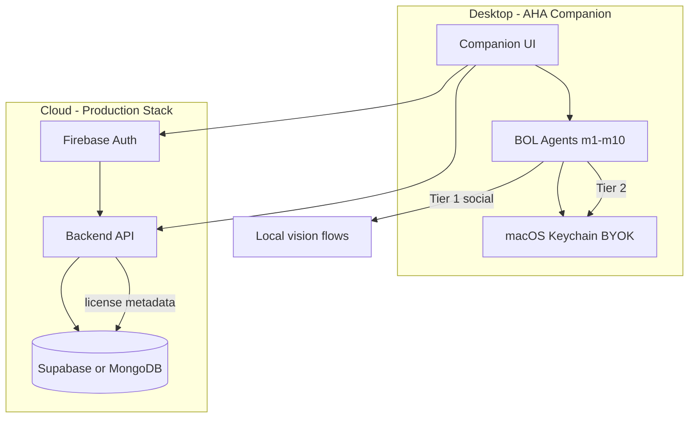

# Reinvent Plan — AHA Industry-Standard Production Roadmap

**Document:** Single workspace reference for production readiness  
**Product:** AHA (Artificial Human Assistant) @ dailyassist.xyz  
**Philosophy:** See `AHA_PHILOSOPHY.md` (assistant, never automation)  
**Status:** Audit snapshot — implement in phases without blind deletions

### Workflow rule (remember)

**After each phase completes**, tell the user which **Cursor model** to select for the **next** phase (table below). Do not skip this when closing out a phase.

---

## Cursor model per phase

Use this when starting or finishing a phase in Cursor. “Next phase” = what to pick **after** you mark the current phase done.

| Phase | Cursor model to use | Why |
|-------|---------------------|-----|
| **0 — Safety** | **Composer** (or **GPT-5.3 Codex**) | Small config edits (`.gitignore`, docs); low risk |
| **1 — BYOK correctness** | **GPT-5.3 Codex** or **Composer** | Multi-file wiring (`license.py`, `agent.py`, `companion.html`); needs accuracy |
| **2 — Local security** | **Claude 4.6 Sonnet (thinking)** or **Claude Opus 4.8 (thinking)** | Auth, CORS, injection, path traversal — reasoning over speed |
| **3 — Cloud** | **Claude Sonnet (thinking)** or **Opus** | Firebase + DB + API design; architecture decisions |
| **4 — Reliability & tests** | **Composer** + terminal pytest | Iterative test/fix loops; executor + CI |
| **5 — Distribution** | **Composer** or **Sonnet** | Packaging, legal copy, plist/notarization docs |

**After Phase 0 → tell user:** use **Codex or Composer** for Phase 1.  
**After Phase 1 → tell user:** use **Sonnet or Opus (thinking)** for Phase 2.  
**After Phase 2 → tell user:** use **Sonnet or Opus** for Phase 3.  
**After Phase 3 → tell user:** use **Composer** for Phase 4.  
**After Phase 4 → tell user:** use **Composer or Sonnet** for Phase 5.

---

## Executive Summary

| Area | Verdict |
|------|---------|
| **Core agent design (m1–m10, vision, kinematics, Tier-1 flows)** | Strong foundation — keep and harden |
| **Companion + server platform layer** | Not production-ready for public users |
| **BYOK** | Highest risk: keys stored but **not used**; plaintext storage; unauthenticated APIs; confusion with `.env` |
| **Multi-user SaaS (Firebase + DB)** | Not integrated — stack choice is fine, wiring is missing |
| **Tests** | Good on physics/math modules; weak on API, BYOK, companion, license, vault integration |

**Bottom line:** Trusted beta on a user's own Mac is possible after BYOK wiring, secrets handling, and broken UI fixes. Public launch needs auth, server-side license, secure keys, and the phased plan below — **without** removing the core month of work in `bol/`, `VISIONBUTTONS/`, and companion UI.

---

## Industry-Standard Target Architecture

### Recommended stack

| Layer | Choice |
|-------|--------|
| Dev | Git, Cursor (not runtime) |
| Auth | Firebase Auth |
| Database | **One of:** Supabase (Postgres) **or** MongoDB — not both for the same data |
| Desktop | `app_webview.py` + local FastAPI (`127.0.0.1:8000`) |
| Tier 1 | `m9_social` + `VISIONBUTTONS/` — no user AI key |
| Tier 2 | BYOK → Gemini/OpenAI via agent |

### BYOK principles (non-negotiable)

1. **Tier-1 social:** No user AI key required.
2. **Tier-2:** User key from **macOS Keychain** (preferred) or encrypted vault — not long-term plaintext JSON.
3. **Keys never in git** — `.env`, `~/.aha/` in `.gitignore`; rotate anything ever exposed.
4. **Local server:** Bind `127.0.0.1` only; session token or OS-bound secret on every automation route.
5. **License:** Enforced on **server**, not UI-only overlay.
6. **Cloud DB:** Licenses, vault **metadata**, audit logs — not raw API keys unless KMS-encrypted per user.

---

## Critical Findings (fix before public users)

### BYOK & secrets

| ID | Issue | Location | Risk |
|----|--------|----------|------|
| C1 | BYOK in Settings never reaches agent | `get_raw_api_key()` in `aha/license.py` has **zero callers**; agent uses `BOL_GEMINI_API_KEY` / `BOL_OPENAI_API_KEY` only | Users believe Tier-2 works with saved key; it does not |
| C2 | API keys stored **plaintext** | `~/.aha/config.json` via `aha/license.py` | Local exposure on shared machines |
| C3 | **`.env` not in `.gitignore`** | `.gitignore` | Accidental commit of live keys |
| C4 | Unauthenticated BYOK endpoints | `POST/GET/DELETE /api/config/*` in `aha/api_routes.py` | Any local process can read/write/delete keys |
| C5 | Provider mismatch | UI `"google"` vs runtime `gemini` / `BOL_GEMINI_API_KEY` | Wiring BYOK still fails without mapping |
| C6 | `POST /api/content/generate` accepts `api_key` in body | `server.py` | Key over HTTP; bypasses BYOK pattern |

### Security & control (computer-use blast radius)

| ID | Issue | Location | Risk |
|----|--------|----------|------|
| C7 | No auth on automation APIs | `server.py` — chat, click, type, OCR, workflows, vault | Full mouse/keyboard for any localhost caller |
| C8 | CORS `allow_origins=["*"]` + `allow_credentials=True` | `server.py` | Localhost CSRF while AHA runs |
| C9 | License UI-only; server never checks | `companion.html` gate; no `check_license` in `server.py` | Bypass via direct API |
| C10 | Trivial license validation | `aha/license.py` — `AHA-` + len 18 → valid until 2099 | No real licensing |
| C11 | AppleScript injection via LLM `url` | `agent.py` ~678–689 | Crafted URL → arbitrary AppleScript |
| C12 | OTA workflows without signature | `ota_fetcher.py`, `workflow_runner.py` | Supply-chain physical actions |
| C13 | Screenshots unauthenticated | Agent/browser endpoints | Sensitive on-screen data leaked |

### Broken user-facing behavior

| ID | Issue | Location | Impact |
|----|--------|----------|--------|
| C14 | Settings key status wrong | `get_api_keys()` flat map vs `data.api_keys[provider]` in `companion.html` | Always shows “no key configured” |
| C15 | Vision click wrong endpoint | Companion `/api/agent/click` vs server `/api/browser/click` | Manual clicks fail |
| C16 | Gemini required at agent init | `agent.py` L43–44 | Tier-1-only users still need `.env` Gemini |

---

## High Findings

### Architecture & data

| ID | Issue | Details |
|----|--------|---------|
| H1 | Two vault systems | Plan layout (`aha/storage_vault.py`) vs companion `Slots/` (`server.py`, `agent.py`) |
| H2 | Duplicate `storage files/cusear/` | Parallel vault copy — diff before merge; **do not delete blindly** |
| H3 | Vault path traversal on `{slot}` | Only create sanitizes; GET/POST routes use raw `slot` |
| H4 | Global singletons, no locking | `_agent_instance`, `_executor`, `_config`, `_routine_scheduler` |
| H5 | Stale config after BYOK save | Singleton never reloads keys |

### m9_social (Tier-1)

| ID | Issue | Location |
|----|--------|----------|
| H6 | `confirm_template` / `confirm_text` never enforced | `flows.py` vs `executor.py` |
| H7 | Missing `whatsapp_text_status_icon` template | `flows.py` vs `VISIONBUTTONS/whatsappbuttons/` |
| H8 | `HOVER_AND_VERIFY` — `cv2` not in scope | `executor.py` ~387 |
| H9 | WhatsApp DM `contact_name` not substituted | `flows.py`, `agent.py` |

### Legal / brand

| ID | Issue | Location |
|----|--------|----------|
| H10 | Placeholder legal contact | `web/legal.html` |
| H11 | “Automation” in Terms | Conflicts with `AHA_PHILOSOPHY.md` |
| H12 | Privacy omits BYOK + screen capture | `web/legal.html` |
| H13 | Footer missing Security Policy link | `companion.html` vs `legal.html` |

---

## Medium Findings

| ID | Issue |
|----|--------|
| M1 | License gate fails open on `/api/license/status` error |
| M2 | Chat refresh clears UI only, not `POST /api/agent/clear` |
| M3 | Auto-continue 10s loop — no cancel/overlap guard |
| M4 | Many fetches skip `res.ok` |
| M5 | Hardcoded `gemini-1.5-pro` vs config `gemini-3.1-flash-lite` |
| M6 | Deprecated `google.generativeai` SDK |
| M7 | FastAPI `@app.on_event("startup")` deprecated |
| M8 | Vault uploads not atomic (helpers exist in `storage_vault.py`) |
| M9 | Social flow returns stale/blank vision image |
| M10 | `start.command` file:// vs `http://127.0.0.1:8000` |
| M11 | Anthropic in Settings — not implemented |
| M12 | `companion.html` unclosed `vault-controls` div |
| M13 | Implicit global `currentUploadDay` in JS |
| M14 | Exception strings returned to client |
| M15 | `pyproject.toml` missing companion deps (e.g. pywebview) |

---

## Low / Positive Notes

| Good | Detail |
|------|--------|
| SQL | Parameterized queries in timing DB |
| Python safety | No `eval`/`exec`/`pickle`/`shell=True` in automation paths |
| Randomness | `secrets` module in kinematics/timing |
| Local bind | `app_webview.py` uses `127.0.0.1` |
| Tests | ~58 test functions under `tests/` for core modules |

---

## Do NOT Delete (protect core work)

| Keep | Why |
|------|-----|
| `bol/modules/m1`–`m10` | Core product |
| `bol/modules/m9_social/` + `VISIONBUTTONS/` | Tier-1 |
| `web/companion.html` | Main UX — fix in place |
| `aha/storage_vault.py`, `aha/media_folders.py` | Plan-based vault |
| `server.py` vault `Slots/` API | Companion calendar — unify paths, don’t delete one without migration |
| `AGENT_ARCHITECTURE.md`, `AHA_PHILOSOPHY.md` | Source of truth |
| `test_*.py` + `tests/` | Tests and experiments |
| `app_webview.py`, `start_companion.command` | Desktop entry |

**Ambiguous:** `storage files/cusear/` — merge into `aha/` after diff; do not delete until imports are confirmed.

---

## Phased Implementation Plan

### Phase 0 — Safety (1–2 days)

**Cursor model:** Composer or GPT-5.3 Codex

- [ ] Add to `.gitignore`: `.env`, `~/.aha/`, secrets patterns (keep files on disk)
- [ ] Rotate API keys if `.env` was ever committed or shared
- [ ] Document: Tier-1 = no AI key; Tier-2 = BYOK or `.env`

### Phase 1 — BYOK correctness (desktop beta) ✅

**Cursor model:** GPT-5.3 Codex or Composer

- [x] Wire `get_raw_api_key("google")` → Gemini; `"openai"` → OpenAI (`aha/byok.py`, `agent.py`)
- [x] Fallback: BYOK → `.env` → clear chat error (`tier2_api_key_missing_message`)
- [x] Fix `get_api_keys` response shape (`api_keys` nested)
- [x] Fix vision click → `/api/browser/click`
- [x] Lazy-init Gemini only for Tier-2 (no key required at `AutonomousCompanion.__init__`)
- [x] Reload agent when key changes (`aha/agent_runtime.reset_agent` on save/delete)
- [ ] Optional: macOS Keychain for storage (deferred to Phase 2+)

### Phase 2 — Local security hardening ✅

**Cursor model:** Claude 4.6 Sonnet (thinking) or Claude Opus 4.8 (thinking)

- [x] Session token on all `/api/*` (`aha/security.py`, injected via `/companion` route)
- [x] Server-side `check_license()` on protected routes (security middleware)
- [x] CORS: `http://127.0.0.1:8000` only, `allow_credentials=False`
- [x] Sanitize all vault `{slot}` params — `_safe_slot()` on all GET/POST/media routes
- [x] Upload extension allowlist (`_ALLOWED_IMAGE_EXT`, `_ALLOWED_VIDEO_EXT`)
- [x] Escape AppleScript URL (quote/backslash sanitize before embedding)
- [x] Windows Chrome launcher (`sys.platform == "win32"` branch in `agent.py`)
- [x] Chat refresh → `POST /api/agent/clear` (server history reset)
- [x] `start.bat` fixed to launch `app_webview.py` (not sandbox)
- [x] `INSTALL.md` — Mac + Windows install steps without code signing
- [x] `.gitignore` — `.env`, secrets, build artifacts added
- [ ] OTA workflow URL signing (deferred — low priority until OTA is active)

### Phase 3 — Cloud (Firebase + Supabase) ✅

**Cursor model:** Claude Sonnet (thinking) or Opus

- [x] Firebase Auth sign-in UI in companion (email/password + Google)
- [x] `POST /api/auth/firebase_signin` — verifies ID token, upserts user in Supabase
- [x] `aha/firebase_auth.py` — `firebase-admin` token verification
- [x] `aha/supabase_client.py` — shared client, user/license/vault helpers
- [x] Supabase schema: `aha_users`, `aha_licenses`, `aha_vault_meta`, `aha_slots` + RLS
- [x] Supabase Storage bucket `aha-vault` with per-user RLS
- [x] `.env.example` — all keys documented
- [x] Service account JSON gitignored
- [x] Privacy Policy update (BYOK, screen data) — `web/legal.html`
- [ ] Supabase migrations need to be run manually in dashboard (see below)

### Phase 4 — Reliability & coding standards ✅

**Cursor model:** Composer (run pytest in terminal between fixes)

- [x] Lock on `AutonomousCompanion.step()` via `aha/agent_runtime.agent_step()`
- [x] `confirm_template` / `confirm_text` enforced in `m9_social/executor.py`
- [x] WhatsApp template alias `whatsapp_text_status_icon` → `whatsapp_new_status_icon`
- [x] Tests: vault paths, vision aliases, agent lock, executor confirm, BYOK (Phase 1)
- [x] CI: `.github/workflows/ci.yml` (pytest on push/PR)
- [x] Atomic vault writes via `storage_vault.atomic_write_*`
- [x] `pyproject.toml` + `requirements.txt` — firebase-admin, supabase, pywebview
- [ ] Migrate `google.generativeai` → `google-genai` (deferred — SDK migration)
- [ ] gitleaks in CI (optional add when secrets scan needed)

### Pre-launch (when live URL is ready) — Razorpay webhook

- [ ] **Reminder:** Enable Razorpay webhook before production traffic — see `BILLING.md` → “Before go-live”.
- [ ] Live `RAZORPAY_KEY_ID` / `RAZORPAY_KEY_SECRET` + `RAZORPAY_WEBHOOK_SECRET`
- [ ] Webhook URL: `https://<live-domain>/api/billing/webhook` → event `payment.captured`

### Phase 5 — Distribution ✅

**Cursor model:** Composer or Claude Sonnet

- [x] `DISTRIBUTION.md` — unsigned zip (default) + optional notarization/signing guide
- [x] First-run permissions guide in `web/companion.html` (Accessibility + Screen Recording)
- [x] `web/legal.html` — assistant-only language, BYOK, screen capture, real contacts
- [x] dailyassist.xyz + support@dailyassist.xyz in footers and policies
- [ ] Signed, notarized macOS app (optional — requires Apple Developer account)

---

## BYOK Production Checklist

| Requirement | Today | Target |
|-------------|-------|--------|
| User saves key in Settings | Writes `~/.aha/config.json` | + Keychain |
| Agent uses key for Tier-2 | **No** | **Yes** |
| Tier-1 uses key | No (correct) | No |
| Encrypted at rest | **No** | Keychain or AES |
| Raw key in API GET | Masked (UI broken) | Never raw |
| Key in git | `.env` risk | `.gitignore` + scan |
| Anthropic in UI | Shown, unused | Remove or implement |
| Missing key UX | Unclear | Explicit chat message |

---

## Test Coverage Gaps (add tests; keep existing)

- [ ] `aha/license.py` — set/get/delete, `get_raw_api_key`
- [ ] `get_api_keys` response contract (companion)
- [ ] `/api/browser/click` endpoint
- [ ] Vault slot sanitization on all routes
- [ ] License middleware on agent routes
- [ ] Social confirm steps (after implementation)
- [ ] E2E: save BYOK → Tier-2 request uses user key (mocked)

---

## Implementation Priority Order

1. **Phase 0** — gitignore + key rotation  
2. **Phase 1** — BYOK wire-up + companion bugs  
3. **Phase 2** — localhost auth + license + CORS + vault  
4. **Phase 3** — Firebase + DB  
5. **Phase 4** — m9_social confirms + tests + SDK  
6. **Phase 5** — distribution + legal  

---

## Related Documents

| File | Purpose |
|------|---------|
| `AHA_PHILOSOPHY.md` | Brand, tiers, module map |
| `AGENT_ARCHITECTURE.md` | Tier-1 vs Tier-2 routing |
| `.cursor/rules/aha-philosophy.mdc` | Agent session rules |

---

*Generated from full codebase audit. Update this file as phases complete.*
