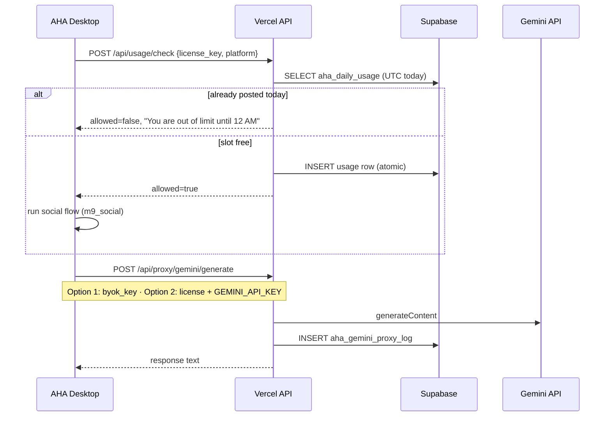

# Vercel Cloud Backend — dailyassist.xyz

Central security checkpoint for AHA desktop apps. Deployed via the existing Vercel entry (`api/index.py` → `aha/vercel_app.py`).

## Architecture



## Database schema

Migration: `supabase/migrations/006_daily_usage.sql`

| Table | Purpose |
|-------|---------|
| `aha_daily_usage` | One row per `license_key` + `platform` + UTC `usage_date` |
| `aha_gemini_proxy_log` | Audit trail for proxied Gemini calls |

Unique constraint `(user_id, platform, usage_date)` makes the daily limit tamper-proof.

## Daily lockout

- **Identity:** `license_key` from `~/.aha/license.json`
- **Reset:** Midnight **UTC** (server time; not the user's clock)
- **Limit:** 1 verified social post per platform per day
- **Message:** `You are out of limit until 12 AM`
- **Dev bypass:** `AHA_DEV_OPEN_GATES=1` (never in retail builds)

### Completion-only counting (power-cut safe)

1. **Start:** `POST /api/usage/check` — read-only; does **not** reserve a slot
2. **Run:** Desktop executes the social flow
3. **Verify:** After the final Post/Share/Send click, screenshot + template/OCR check
4. **Complete:** Only then — vault tick + `POST /api/usage/confirm`

If the app closes mid-flow, verification never runs, the server is never notified, and the user can retry the same day.

## Dual-tier Gemini auth

| Tier | Desktop sends | Server uses |
|------|---------------|-------------|
| Option 1 (BYOK) | `byok_key` + `license_key` | User's key (pass-through) |
| Option 2 (License) | `license_key` only | `GEMINI_API_KEY` on Vercel |

## Admin dashboard

- URL: `https://www.dailyassist.xyz/admin`
- Auth: Firebase Google sign-in + `AHA_ADMIN_EMAILS` allowlist
- Usage API: `GET /api/admin/usage?days=14`

## Cloud request auth

Desktop calls include `firebase_id_token` (saved at sign-in in `~/.aha/firebase_session.json`).
Vercel matches the token’s Firebase `uid` to the `license_key` owner in `aha_licenses`.

| Env | Behavior |
|-----|----------|
| `AHA_REQUIRE_CLOUD_AUTH=1` | Always require matching Firebase token |
| `VERCEL_ENV=production` (default) | Auth required when env not explicitly disabled |
| `AHA_REQUIRE_CLOUD_AUTH=0` | Legacy: `license_key` alone (dev only) |

## Direct Access Gemini quotas (Option 2)

Before calling Gemini with our key, Vercel checks `aha_gemini_proxy_log`:

| Limit | Default |
|-------|---------|
| Per minute | 6 |
| Per hour | 40 |
| Per day | 150 |

Override via `AHA_GEMINI_MAX_CALLS_PER_MINUTE`, `_PER_HOUR`, `_PER_DAY`.

## Vercel environment variables

```
GEMINI_API_KEY=...          # Option 2 master key
SUPABASE_URL=...
SUPABASE_SERVICE_ROLE_KEY=...
AHA_ADMIN_EMAILS=you@gmail.com
AHA_ADMIN_SECRET=...        # optional automation header
AHA_REQUIRE_CLOUD_AUTH=1    # recommended for production
```

## Desktop environment

```
AHA_CLOUD_API_URL=https://www.dailyassist.xyz   # optional override
AHA_SKIP_CLOUD_LIMITS=1                         # dev only
AHA_SKIP_CLOUD_PROXY=1                            # dev only
```
